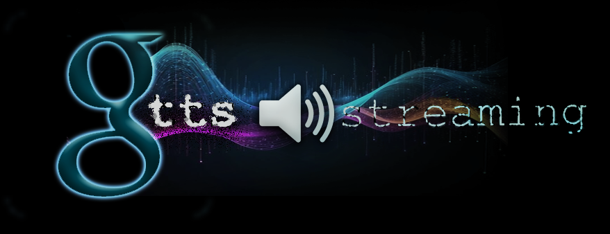

# Streaming Text to Speech via gTTS
<p align = "center">

</p>

## From the [gTTS repository](https://github.com/pndurette/gTTS):
**gTTS** *(Google Text-to-Speech)*, a Python library and CLI tool to interface with Google Translate's text-to-speech API. Write spoken ```mp3``` data to a file, a file-like object (bytestring) for further audio manipulation, or ```stdout```. https://gtts.readthedocs.io/

## Introduction:
This is a simple one-file script that seeks to stream gTTS audio given a large piece of text.

I love the gTTS library. It is an incredible hack on Google Translate's speech functionality. From the repo:
```
This project is leveraging the undocumented Google Translate speech functionality and is different from Google Cloud Text-to-Speech.
```

However, the repo does not detail how to do the following:
1. Play the audio without saving it
2. Stream the audio as the text is being processed.

This library leverages gTTS's incredible STT abilities to stream the audio of a text string
